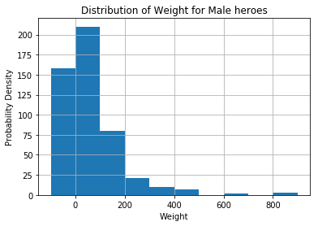
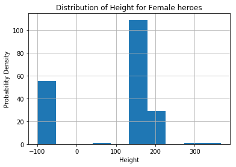
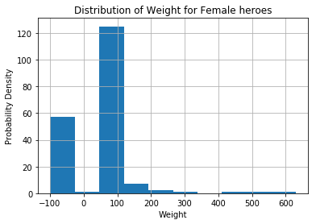
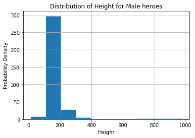
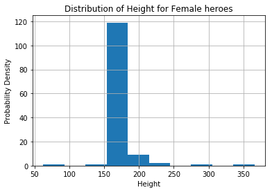
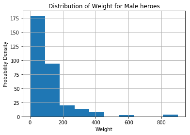
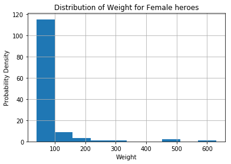
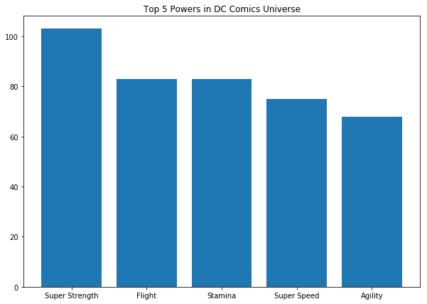
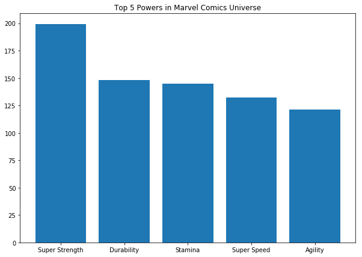

# Project - Data Cleaning

## Introduction
In this lab, we'll make use of everything we've learned about pandas, data cleaning, and Exploratory Data Analysis. In order to complete this lab, you'll have to make import, clean, combine, reshape, and visualize data to answer questions provided, as well as your own questions!

## Objectives
You will be able to:
* Show mastery of the content covered in this section

## The Dataset
In this lab, we'll work with the comprehensive [Super Heroes Dataset](https://www.kaggle.com/claudiodavi/superhero-set/data), which can be found on Kaggle!

## Goals
* Use all available pandas knowledge to clean the dataset and deal with null values
* Use Queries and aggregations to group the data into interesting subsets as needed
* Use descriptive statistics and data visualization to find answers to questions we may have about the data. 

## Getting Started

In the cell below:

* Import and alias pandas as `pd`
* Import and alias numpy as `np`
* Import and alias seaborn as `sns`
* Import and alias matplotlib.pyplot as `plt`
* Set matplotlib visualizations to display inline in the notebook


```python
import pandas as pd
import numpy as np
import seaborn as sns
import matplotlib.pyplot as plt
%matplotlib inline
```


```python
# __SOLUTION__ 
import pandas as pd
import numpy as np
import seaborn as sns
import matplotlib.pyplot as plt
%matplotlib inline
```

For this lab, our dataset is split among two different sources--`heroes_information.csv` and `super_hero_powers.csv`.

Use pandas to read in each file and store them in DataFrames in the appropriate variables below. Then, display the head of each to ensure that everything loaded correctly.  


```python
heroes_df = None
powers_df = None
```


```python
# __SOLUTION__ 
heroes_df = pd.read_csv('heroes_information.csv')
powers_df = pd.read_csv('super_hero_powers.csv')

display(heroes_df.head())
powers_df.head()
```


<div>
<style scoped>
    .dataframe tbody tr th:only-of-type {
        vertical-align: middle;
    }

    .dataframe tbody tr th {
        vertical-align: top;
    }

    .dataframe thead th {
        text-align: right;
    }
</style>
<table border="1" class="dataframe">
  <thead>
    <tr style="text-align: right;">
      <th></th>
      <th>Unnamed: 0</th>
      <th>name</th>
      <th>Gender</th>
      <th>Eye color</th>
      <th>Race</th>
      <th>Hair color</th>
      <th>Height</th>
      <th>Publisher</th>
      <th>Skin color</th>
      <th>Alignment</th>
      <th>Weight</th>
    </tr>
  </thead>
  <tbody>
    <tr>
      <th>0</th>
      <td>0</td>
      <td>A-Bomb</td>
      <td>Male</td>
      <td>yellow</td>
      <td>Human</td>
      <td>No Hair</td>
      <td>203.0</td>
      <td>Marvel Comics</td>
      <td>-</td>
      <td>good</td>
      <td>441.0</td>
    </tr>
    <tr>
      <th>1</th>
      <td>1</td>
      <td>Abe Sapien</td>
      <td>Male</td>
      <td>blue</td>
      <td>Icthyo Sapien</td>
      <td>No Hair</td>
      <td>191.0</td>
      <td>Dark Horse Comics</td>
      <td>blue</td>
      <td>good</td>
      <td>65.0</td>
    </tr>
    <tr>
      <th>2</th>
      <td>2</td>
      <td>Abin Sur</td>
      <td>Male</td>
      <td>blue</td>
      <td>Ungaran</td>
      <td>No Hair</td>
      <td>185.0</td>
      <td>DC Comics</td>
      <td>red</td>
      <td>good</td>
      <td>90.0</td>
    </tr>
    <tr>
      <th>3</th>
      <td>3</td>
      <td>Abomination</td>
      <td>Male</td>
      <td>green</td>
      <td>Human / Radiation</td>
      <td>No Hair</td>
      <td>203.0</td>
      <td>Marvel Comics</td>
      <td>-</td>
      <td>bad</td>
      <td>441.0</td>
    </tr>
    <tr>
      <th>4</th>
      <td>4</td>
      <td>Abraxas</td>
      <td>Male</td>
      <td>blue</td>
      <td>Cosmic Entity</td>
      <td>Black</td>
      <td>-99.0</td>
      <td>Marvel Comics</td>
      <td>-</td>
      <td>bad</td>
      <td>-99.0</td>
    </tr>
  </tbody>
</table>
</div>


<div>
<style scoped>
    .dataframe tbody tr th:only-of-type {
        vertical-align: middle;
    }

    .dataframe tbody tr th {
        vertical-align: top;
    }

    .dataframe thead th {
        text-align: right;
    }
</style>
<table border="1" class="dataframe">
  <thead>
    <tr style="text-align: right;">
      <th></th>
      <th>hero_names</th>
      <th>Agility</th>
      <th>Accelerated Healing</th>
      <th>Lantern Power Ring</th>
      <th>Dimensional Awareness</th>
      <th>Cold Resistance</th>
      <th>Durability</th>
      <th>Stealth</th>
      <th>Energy Absorption</th>
      <th>Flight</th>
      <th>...</th>
      <th>Web Creation</th>
      <th>Reality Warping</th>
      <th>Odin Force</th>
      <th>Symbiote Costume</th>
      <th>Speed Force</th>
      <th>Phoenix Force</th>
      <th>Molecular Dissipation</th>
      <th>Vision - Cryo</th>
      <th>Omnipresent</th>
      <th>Omniscient</th>
    </tr>
  </thead>
  <tbody>
    <tr>
      <th>0</th>
      <td>3-D Man</td>
      <td>True</td>
      <td>False</td>
      <td>False</td>
      <td>False</td>
      <td>False</td>
      <td>False</td>
      <td>False</td>
      <td>False</td>
      <td>False</td>
      <td>...</td>
      <td>False</td>
      <td>False</td>
      <td>False</td>
      <td>False</td>
      <td>False</td>
      <td>False</td>
      <td>False</td>
      <td>False</td>
      <td>False</td>
      <td>False</td>
    </tr>
    <tr>
      <th>1</th>
      <td>A-Bomb</td>
      <td>False</td>
      <td>True</td>
      <td>False</td>
      <td>False</td>
      <td>False</td>
      <td>True</td>
      <td>False</td>
      <td>False</td>
      <td>False</td>
      <td>...</td>
      <td>False</td>
      <td>False</td>
      <td>False</td>
      <td>False</td>
      <td>False</td>
      <td>False</td>
      <td>False</td>
      <td>False</td>
      <td>False</td>
      <td>False</td>
    </tr>
    <tr>
      <th>2</th>
      <td>Abe Sapien</td>
      <td>True</td>
      <td>True</td>
      <td>False</td>
      <td>False</td>
      <td>True</td>
      <td>True</td>
      <td>False</td>
      <td>False</td>
      <td>False</td>
      <td>...</td>
      <td>False</td>
      <td>False</td>
      <td>False</td>
      <td>False</td>
      <td>False</td>
      <td>False</td>
      <td>False</td>
      <td>False</td>
      <td>False</td>
      <td>False</td>
    </tr>
    <tr>
      <th>3</th>
      <td>Abin Sur</td>
      <td>False</td>
      <td>False</td>
      <td>True</td>
      <td>False</td>
      <td>False</td>
      <td>False</td>
      <td>False</td>
      <td>False</td>
      <td>False</td>
      <td>...</td>
      <td>False</td>
      <td>False</td>
      <td>False</td>
      <td>False</td>
      <td>False</td>
      <td>False</td>
      <td>False</td>
      <td>False</td>
      <td>False</td>
      <td>False</td>
    </tr>
    <tr>
      <th>4</th>
      <td>Abomination</td>
      <td>False</td>
      <td>True</td>
      <td>False</td>
      <td>False</td>
      <td>False</td>
      <td>False</td>
      <td>False</td>
      <td>False</td>
      <td>False</td>
      <td>...</td>
      <td>False</td>
      <td>False</td>
      <td>False</td>
      <td>False</td>
      <td>False</td>
      <td>False</td>
      <td>False</td>
      <td>False</td>
      <td>False</td>
      <td>False</td>
    </tr>
  </tbody>
</table>
<p>5 rows × 168 columns</p>
</div>


It looks as if the heroes information dataset contained an index column.  We did not specify that this dataset contained an index column, because we hadn't seen it yet. Pandas does not know how to tell apart an index column from any other data, so it stored it with the column name `Unnamed: 0`.  

Our DataFrame provided row indices by default, so this column is not needed.  Drop it from the DataFrame in place in the cell below, and then display the head of `heroes_df` to ensure that it worked properly. 


```python

```


```python
# __SOLUTION__ 
heroes_df.drop("Unnamed: 0", axis=1, inplace=True)
heroes_df.head()
```


<div>
<style scoped>
    .dataframe tbody tr th:only-of-type {
        vertical-align: middle;
    }

    .dataframe tbody tr th {
        vertical-align: top;
    }

    .dataframe thead th {
        text-align: right;
    }
</style>
<table border="1" class="dataframe">
  <thead>
    <tr style="text-align: right;">
      <th></th>
      <th>name</th>
      <th>Gender</th>
      <th>Eye color</th>
      <th>Race</th>
      <th>Hair color</th>
      <th>Height</th>
      <th>Publisher</th>
      <th>Skin color</th>
      <th>Alignment</th>
      <th>Weight</th>
    </tr>
  </thead>
  <tbody>
    <tr>
      <th>0</th>
      <td>A-Bomb</td>
      <td>Male</td>
      <td>yellow</td>
      <td>Human</td>
      <td>No Hair</td>
      <td>203.0</td>
      <td>Marvel Comics</td>
      <td>-</td>
      <td>good</td>
      <td>441.0</td>
    </tr>
    <tr>
      <th>1</th>
      <td>Abe Sapien</td>
      <td>Male</td>
      <td>blue</td>
      <td>Icthyo Sapien</td>
      <td>No Hair</td>
      <td>191.0</td>
      <td>Dark Horse Comics</td>
      <td>blue</td>
      <td>good</td>
      <td>65.0</td>
    </tr>
    <tr>
      <th>2</th>
      <td>Abin Sur</td>
      <td>Male</td>
      <td>blue</td>
      <td>Ungaran</td>
      <td>No Hair</td>
      <td>185.0</td>
      <td>DC Comics</td>
      <td>red</td>
      <td>good</td>
      <td>90.0</td>
    </tr>
    <tr>
      <th>3</th>
      <td>Abomination</td>
      <td>Male</td>
      <td>green</td>
      <td>Human / Radiation</td>
      <td>No Hair</td>
      <td>203.0</td>
      <td>Marvel Comics</td>
      <td>-</td>
      <td>bad</td>
      <td>441.0</td>
    </tr>
    <tr>
      <th>4</th>
      <td>Abraxas</td>
      <td>Male</td>
      <td>blue</td>
      <td>Cosmic Entity</td>
      <td>Black</td>
      <td>-99.0</td>
      <td>Marvel Comics</td>
      <td>-</td>
      <td>bad</td>
      <td>-99.0</td>
    </tr>
  </tbody>
</table>
</div>


## Familiarize Yourself With the Dataset

The first step in our Exploratory Data Analysis will be to get familiar with the data.  This step includes:

* Understanding the dimensionality of your dataset
* Investigating what type of data it contains, and the data types used to store it
* Discovering how missing values are encoded, and how many there are
* Getting a feel for what information it does and doesn't contain

In the cell below, get the descriptive statistics of each DataFrame.  


```python

```


```python
# __SOLUTION__ 
display(heroes_df.describe())
powers_df.describe()
```


<div>
<style scoped>
    .dataframe tbody tr th:only-of-type {
        vertical-align: middle;
    }

    .dataframe tbody tr th {
        vertical-align: top;
    }

    .dataframe thead th {
        text-align: right;
    }
</style>
<table border="1" class="dataframe">
  <thead>
    <tr style="text-align: right;">
      <th></th>
      <th>Height</th>
      <th>Weight</th>
    </tr>
  </thead>
  <tbody>
    <tr>
      <th>count</th>
      <td>734.000000</td>
      <td>732.000000</td>
    </tr>
    <tr>
      <th>mean</th>
      <td>102.254087</td>
      <td>43.855191</td>
    </tr>
    <tr>
      <th>std</th>
      <td>139.624543</td>
      <td>130.823733</td>
    </tr>
    <tr>
      <th>min</th>
      <td>-99.000000</td>
      <td>-99.000000</td>
    </tr>
    <tr>
      <th>25%</th>
      <td>-99.000000</td>
      <td>-99.000000</td>
    </tr>
    <tr>
      <th>50%</th>
      <td>175.000000</td>
      <td>62.000000</td>
    </tr>
    <tr>
      <th>75%</th>
      <td>185.000000</td>
      <td>90.000000</td>
    </tr>
    <tr>
      <th>max</th>
      <td>975.000000</td>
      <td>900.000000</td>
    </tr>
  </tbody>
</table>
</div>


<div>
<style scoped>
    .dataframe tbody tr th:only-of-type {
        vertical-align: middle;
    }

    .dataframe tbody tr th {
        vertical-align: top;
    }

    .dataframe thead th {
        text-align: right;
    }
</style>
<table border="1" class="dataframe">
  <thead>
    <tr style="text-align: right;">
      <th></th>
      <th>hero_names</th>
      <th>Agility</th>
      <th>Accelerated Healing</th>
      <th>Lantern Power Ring</th>
      <th>Dimensional Awareness</th>
      <th>Cold Resistance</th>
      <th>Durability</th>
      <th>Stealth</th>
      <th>Energy Absorption</th>
      <th>Flight</th>
      <th>...</th>
      <th>Web Creation</th>
      <th>Reality Warping</th>
      <th>Odin Force</th>
      <th>Symbiote Costume</th>
      <th>Speed Force</th>
      <th>Phoenix Force</th>
      <th>Molecular Dissipation</th>
      <th>Vision - Cryo</th>
      <th>Omnipresent</th>
      <th>Omniscient</th>
    </tr>
  </thead>
  <tbody>
    <tr>
      <th>count</th>
      <td>667</td>
      <td>667</td>
      <td>667</td>
      <td>667</td>
      <td>667</td>
      <td>667</td>
      <td>667</td>
      <td>667</td>
      <td>667</td>
      <td>667</td>
      <td>...</td>
      <td>667</td>
      <td>667</td>
      <td>667</td>
      <td>667</td>
      <td>667</td>
      <td>667</td>
      <td>667</td>
      <td>667</td>
      <td>667</td>
      <td>667</td>
    </tr>
    <tr>
      <th>unique</th>
      <td>667</td>
      <td>2</td>
      <td>2</td>
      <td>2</td>
      <td>2</td>
      <td>2</td>
      <td>2</td>
      <td>2</td>
      <td>2</td>
      <td>2</td>
      <td>...</td>
      <td>2</td>
      <td>2</td>
      <td>2</td>
      <td>2</td>
      <td>2</td>
      <td>2</td>
      <td>2</td>
      <td>2</td>
      <td>2</td>
      <td>2</td>
    </tr>
    <tr>
      <th>top</th>
      <td>Skaar</td>
      <td>False</td>
      <td>False</td>
      <td>False</td>
      <td>False</td>
      <td>False</td>
      <td>False</td>
      <td>False</td>
      <td>False</td>
      <td>False</td>
      <td>...</td>
      <td>False</td>
      <td>False</td>
      <td>False</td>
      <td>False</td>
      <td>False</td>
      <td>False</td>
      <td>False</td>
      <td>False</td>
      <td>False</td>
      <td>False</td>
    </tr>
    <tr>
      <th>freq</th>
      <td>1</td>
      <td>425</td>
      <td>489</td>
      <td>656</td>
      <td>642</td>
      <td>620</td>
      <td>410</td>
      <td>541</td>
      <td>590</td>
      <td>455</td>
      <td>...</td>
      <td>653</td>
      <td>651</td>
      <td>665</td>
      <td>658</td>
      <td>666</td>
      <td>666</td>
      <td>666</td>
      <td>665</td>
      <td>665</td>
      <td>665</td>
    </tr>
  </tbody>
</table>
<p>4 rows × 168 columns</p>
</div>


## Dealing with Null Values

Starting in the cell below, detect and deal with any null values in either data frame.  Then, explain your methodology for detecting and dealing with outliers in the markdown section below.  Be sure to explain your strategy for dealing with null values in numeric columns, as well as your strategy for dealing with null values in non-numeric columns.  

Note that if you need to add more cells to write code in, you can do this by:

**1.** Highlighting a cell and then pressing `ESC` to enter command mode.  
**2.** Press `A` to add a cell above the highlighted cell, or `B` to add a cell below the highlighted cell. 

Describe your strategy below this line:
____________________________________________________________________________________________________________________________


```python

```


```python
# __SOLUTION__ 
heroes_df.isna().any()
```


    name          False
    Gender        False
    Eye color     False
    Race          False
    Hair color    False
    Height        False
    Publisher      True
    Skin color    False
    Alignment     False
    Weight         True
    dtype: bool


```python

```


```python
# __SOLUTION__ 
heroes_df.isna().sum()
```


    name           0
    Gender         0
    Eye color      0
    Race           0
    Hair color     0
    Height         0
    Publisher     15
    Skin color     0
    Alignment      0
    Weight         2
    dtype: int64


```python

```


```python
# __SOLUTION__ 
mean_weight = heroes_df.Weight.mean()
heroes_df['Weight'].fillna(mean_weight, inplace=True)
heroes_df.isna().sum()
```


    name           0
    Gender         0
    Eye color      0
    Race           0
    Hair color     0
    Height         0
    Publisher     15
    Skin color     0
    Alignment      0
    Weight         0
    dtype: int64


## Joining, Grouping, and Aggregating

In the cell below, join the two DataFrames.  Think about which sort of join you should use, as well as which columns you should join on.  Rename columns and manipulate as needed.  

**_HINT:_** Consider the possibility that the columns you choose to join on contain duplicate entries. If that is the case, devise a strategy to deal with the duplicates.

**_HINT:_** If the join throws an error message, consider setting the column you want to join on as the index for each DataFrame.  


```python
# __SOLUTION__ 
powers_df.isna().any()
```


    hero_names               False
    Agility                  False
    Accelerated Healing      False
    Lantern Power Ring       False
    Dimensional Awareness    False
    Cold Resistance          False
    Durability               False
    Stealth                  False
    Energy Absorption        False
    Flight                   False
    Danger Sense             False
    Underwater breathing     False
    Marksmanship             False
    Weapons Master           False
    Power Augmentation       False
    Animal Attributes        False
    Longevity                False
    Intelligence             False
    Super Strength           False
    Cryokinesis              False
    Telepathy                False
    Energy Armor             False
    Energy Blasts            False
    Duplication              False
    Size Changing            False
    Density Control          False
    Stamina                  False
    Astral Travel            False
    Audio Control            False
    Dexterity                False
                             ...  
    Intuitive aptitude       False
    Vision - Microscopic     False
    Melting                  False
    Wind Control             False
    Super Breath             False
    Wallcrawling             False
    Vision - Night           False
    Vision - Infrared        False
    Grim Reaping             False
    Matter Absorption        False
    The Force                False
    Resurrection             False
    Terrakinesis             False
    Vision - Heat            False
    Vitakinesis              False
    Radar Sense              False
    Qwardian Power Ring      False
    Weather Control          False
    Vision - X-Ray           False
    Vision - Thermal         False
    Web Creation             False
    Reality Warping          False
    Odin Force               False
    Symbiote Costume         False
    Speed Force              False
    Phoenix Force            False
    Molecular Dissipation    False
    Vision - Cryo            False
    Omnipresent              False
    Omniscient               False
    Length: 168, dtype: bool


```python

```


```python
# __SOLUTION__ 
# Let's check if any of these are True, rather than reading them all, by 
# just chaining another call to .any()
powers_df.isna().any().any()
```


    False


```python

```


```python

```


```python
# __SOLUTION__ 
# Drop duplicate names
heroes_df.drop_duplicates(subset="name", inplace=True)
# Reset index values
heroes_df.reset_index(drop=True, inplace=True)
```

In the cell below, subset male and female heroes into different dataframes.  Create a scatterplot of the height and weight of each hero, with weight as the y-axis.  Plot both the male and female heroes subset into each dataframe, and make the color for each point in the scatterplot correspond to the gender of the superhero.


```python
# __SOLUTION__ 
powers_df.rename(columns={'hero_names':'name'}, inplace=True)
```


```python

```


```python
# __SOLUTION__ 
powers_df  = powers_df.astype('str')
```

## Some Initial Investigation

Next, slice the DataFrame as needed and visualize the distribution of heights and weights by gender.  You should have 4 total plots.  

In the cell below:

* Slice the DataFrame into separate DataFrames by gender
* Complete the `show_distplot` function.  This helper function should take in a DataFrame, a string containing the gender we want to visualize, and the column name we want to visualize by gender. The function should display a distplot visualization from seaborn of the column/gender combination.  

Hint: Don't forget to check the [seaborn documentation for distplot](https://seaborn.pydata.org/generated/seaborn.distplot.html) if you have questions about how to use it correctly! 


```python
# __SOLUTION__ 
heroes_and_powers_df = powers_df.set_index('name').join(heroes_df.set_index('name'), how='inner')
heroes_and_powers_df.head()
```


<div>
<style scoped>
    .dataframe tbody tr th:only-of-type {
        vertical-align: middle;
    }

    .dataframe tbody tr th {
        vertical-align: top;
    }

    .dataframe thead th {
        text-align: right;
    }
</style>
<table border="1" class="dataframe">
  <thead>
    <tr style="text-align: right;">
      <th></th>
      <th>Agility</th>
      <th>Accelerated Healing</th>
      <th>Lantern Power Ring</th>
      <th>Dimensional Awareness</th>
      <th>Cold Resistance</th>
      <th>Durability</th>
      <th>Stealth</th>
      <th>Energy Absorption</th>
      <th>Flight</th>
      <th>Danger Sense</th>
      <th>...</th>
      <th>Omniscient</th>
      <th>Gender</th>
      <th>Eye color</th>
      <th>Race</th>
      <th>Hair color</th>
      <th>Height</th>
      <th>Publisher</th>
      <th>Skin color</th>
      <th>Alignment</th>
      <th>Weight</th>
    </tr>
    <tr>
      <th>name</th>
      <th></th>
      <th></th>
      <th></th>
      <th></th>
      <th></th>
      <th></th>
      <th></th>
      <th></th>
      <th></th>
      <th></th>
      <th></th>
      <th></th>
      <th></th>
      <th></th>
      <th></th>
      <th></th>
      <th></th>
      <th></th>
      <th></th>
      <th></th>
      <th></th>
    </tr>
  </thead>
  <tbody>
    <tr>
      <th>A-Bomb</th>
      <td>False</td>
      <td>True</td>
      <td>False</td>
      <td>False</td>
      <td>False</td>
      <td>True</td>
      <td>False</td>
      <td>False</td>
      <td>False</td>
      <td>False</td>
      <td>...</td>
      <td>False</td>
      <td>Male</td>
      <td>yellow</td>
      <td>Human</td>
      <td>No Hair</td>
      <td>203.0</td>
      <td>Marvel Comics</td>
      <td>-</td>
      <td>good</td>
      <td>441.0</td>
    </tr>
    <tr>
      <th>Abe Sapien</th>
      <td>True</td>
      <td>True</td>
      <td>False</td>
      <td>False</td>
      <td>True</td>
      <td>True</td>
      <td>False</td>
      <td>False</td>
      <td>False</td>
      <td>False</td>
      <td>...</td>
      <td>False</td>
      <td>Male</td>
      <td>blue</td>
      <td>Icthyo Sapien</td>
      <td>No Hair</td>
      <td>191.0</td>
      <td>Dark Horse Comics</td>
      <td>blue</td>
      <td>good</td>
      <td>65.0</td>
    </tr>
    <tr>
      <th>Abin Sur</th>
      <td>False</td>
      <td>False</td>
      <td>True</td>
      <td>False</td>
      <td>False</td>
      <td>False</td>
      <td>False</td>
      <td>False</td>
      <td>False</td>
      <td>False</td>
      <td>...</td>
      <td>False</td>
      <td>Male</td>
      <td>blue</td>
      <td>Ungaran</td>
      <td>No Hair</td>
      <td>185.0</td>
      <td>DC Comics</td>
      <td>red</td>
      <td>good</td>
      <td>90.0</td>
    </tr>
    <tr>
      <th>Abomination</th>
      <td>False</td>
      <td>True</td>
      <td>False</td>
      <td>False</td>
      <td>False</td>
      <td>False</td>
      <td>False</td>
      <td>False</td>
      <td>False</td>
      <td>False</td>
      <td>...</td>
      <td>False</td>
      <td>Male</td>
      <td>green</td>
      <td>Human / Radiation</td>
      <td>No Hair</td>
      <td>203.0</td>
      <td>Marvel Comics</td>
      <td>-</td>
      <td>bad</td>
      <td>441.0</td>
    </tr>
    <tr>
      <th>Abraxas</th>
      <td>False</td>
      <td>False</td>
      <td>False</td>
      <td>True</td>
      <td>False</td>
      <td>False</td>
      <td>False</td>
      <td>False</td>
      <td>True</td>
      <td>False</td>
      <td>...</td>
      <td>False</td>
      <td>Male</td>
      <td>blue</td>
      <td>Cosmic Entity</td>
      <td>Black</td>
      <td>-99.0</td>
      <td>Marvel Comics</td>
      <td>-</td>
      <td>bad</td>
      <td>-99.0</td>
    </tr>
  </tbody>
</table>
<p>5 rows × 176 columns</p>
</div>


```python
male_heroes_df = None
female_heroes_df = None

def show_distplot(dataframe, gender, column_name):
    pass
```


```python
# Male Height

```


```python
# __SOLUTION__ 
male_heroes_df = heroes_df[heroes_df['Gender'] == 'Male']
female_heroes_df = heroes_df[heroes_df['Gender'] == 'Female']

ax = male_heroes_df.plot.scatter(x="Height", y="Weight", c="k", label="Male")
female_heroes_df.plot.scatter(x="Height", y="Weight", c="c", label="Female", ax=ax)
```


    <matplotlib.axes._subplots.AxesSubplot at 0x1a1a161358>


```python
# Male Weight

```


```python
# Female Height

```


```python
# __SOLUTION__ 
male_heroes_df = heroes_df[heroes_df['Gender'] == 'Male']
female_heroes_df = heroes_df[heroes_df['Gender'] == 'Female']

def show_distplot(dataframe, gender, column_name):
    plt.plot()
    dataframe[column_name].hist()
    plt.title("Distribution of {} for {} heroes".format(column_name, gender))
    plt.xlabel(column_name)
    plt.ylabel("Probability Density")
    plt.show()
```


```python
# Female Weight

```


```python
# __SOLUTION__ 
# Male Height
show_distplot(male_heroes_df, 'Male', 'Height')
print("Mean height for male heroes: {}".format(male_heroes_df.Height.mean()))
print("Median height for male heroes: {}".format(male_heroes_df.Height.median()))
```


    Mean height for male heroes: 109.11201629327903
    Median height for male heroes: 180.0


Discuss your findings from the plots above, with respect to the distribution of height and weight by gender.  Your explanation should include discussion of any relevant summary statistics, including mean, median, mode, and the overall shape of each distribution.  

Write your answer below this line:
____________________________________________________________________________________________________________________________


```python
# __SOLUTION__ 
# Male Weight
show_distplot(male_heroes_df, 'Male', 'Weight')
print("Mean weight for male heroes: {}".format(male_heroes_df.Weight.mean()))
print("Median weight for male heroes: {}".format(male_heroes_df.Weight.median()))
```





    Mean weight for male heroes: 53.519053342681936
    Median weight for male heroes: 79.0


### Sample Question: Most Common Powers

The rest of this notebook will be left to you to investigate the dataset by formulating your own questions, and then seeking answers using pandas and numpy.  Every answer should include some sort of visualization, when appropriate. Before moving on to formulating your own questions, use the dataset to answer the following questions about superhero powers:

* What are the 5 most common powers overall?
* What are the 5 most common powers in the Marvel Universe?
* What are the 5 most common powers in the DC Universe?


```python
# __SOLUTION__ 
# Female Height
show_distplot(female_heroes_df, 'Female', 'Height')
print("Mean height for female heroes: {}".format(female_heroes_df.Height.mean()))
print("Median height for female heroes: {}".format(female_heroes_df.Height.median()))
```





    Mean height for female heroes: 97.99234693877551
    Median height for female heroes: 168.0


```python

```


```python
# __SOLUTION__ 
# Female Weight
show_distplot(female_heroes_df, 'Female', 'Weight')
print("Mean weight for female heroes: {}".format(female_heroes_df.Weight.mean()))
print("Median weight for female heroes: {}".format(male_heroes_df.Weight.median()))
```





    Mean weight for female heroes: 27.433673469387756
    Median weight for female heroes: 79.0


```python

```


```python

```


```python
# __SOLUTION__ 
print('Top Negative Heights:')
print(heroes_df[heroes_df.Height < 0].Height.value_counts())

print('Top Negative Weights:')
print(heroes_df[heroes_df.Weight < 0].Weight.value_counts())
```

    Top Negative Heights:
    -99.0    209
    Name: Height, dtype: int64
    Top Negative Weights:
    -99.0    229
    Name: Weight, dtype: int64


```python

```


```python
# __SOLUTION__ 
for feat in ['Height', 'Weight']:
    df = heroes_and_powers_df[heroes_and_powers_df[feat]>0] #Temporarily remove negatives
    for group in ['Male', 'Female']:
        show_distplot(df[df['Gender']==group], group, feat)
        print("Mean {} for {} heroes: {}".format(feat, group, df[df['Gender']==group][feat].mean()))
        print("Median {} for {} heroes: {}".format(feat, group, df[df['Gender']==group][feat].median()))
```





    Mean Height for Male heroes: 192.62314540059347
    Median Height for Male heroes: 185.0





    Mean Height for Female heroes: 174.90671641791045
    Median Height for Female heroes: 170.0





    Mean Weight for Male heroes: 126.84594103842267
    Median Weight for Male heroes: 90.0





    Mean Weight for Female heroes: 80.34848484848484
    Median Weight for Female heroes: 57.5


Analyze the results you found above to answer the following question:

How do the top 5 powers in the Marvel and DC universes compare?  Are they similar, or are there significant differences? How do they compare to the overall trends in the entire Superheroes dataset?

Wite your answer below this line:
____________________________________________________________________________________________________________________________


### Your Own Investigation

For the remainder of this lab, you'll be focusing on coming up with and answering your own question, just like we did above.  Your question should not be overly simple, and should require both descriptive statistics and data visualization to answer.  In case you're unsure of what questions to ask, some sample questions have been provided below.

Pick one of the following questions to investigate and answer, or come up with one of your own!

* Which powers have the highest chance of co-occurring in a hero (e.g. super strength and flight), and does this differ by gender?
* Is there a relationship between a hero's height and weight and their powerset?
* What is the distribution of skin colors amongst alien heroes?

Explain your question below this line:
____________________________________________________________________________________________________________________________


Some sample cells have been provided to give you room to work. If you need to create more cells, you can do this easily by:

1. Highlighting a cell and then pressing `esc` to enter command mode.
1. Pressing `b` to add a cell below the currently highlighted cell, or `a` to add one above it.  

Be sure to include thoughtful, well-labeled visualizations to back up your analysis!


```python

```


```python

```


```python
# __SOLUTION__ 
def top_5_powers(dataframe):
    df = dataframe.drop(heroes_df.columns.values[1:], axis=1)
    columns = df.columns.values
    for col in columns:
        df[col] = df[col].map({"True": 1, "False": 0})
        
    power_counts_dict = dict(df.sum())
    
    return sorted(power_counts_dict.items(), key=lambda x: x[1], reverse=True)[:5] 
    
overall_top_5 = top_5_powers(heroes_and_powers_df)
marvel_df = heroes_and_powers_df[heroes_and_powers_df['Publisher'] == 'Marvel Comics']
dc_df = heroes_and_powers_df[heroes_and_powers_df['Publisher'] == 'DC Comics']
print(overall_top_5)
```

    [('Super Strength', 350), ('Stamina', 281), ('Durability', 251), ('Super Speed', 241), ('Agility', 235)]


```python

```


```python
# __SOLUTION__ 
marvel_top_5 = top_5_powers(marvel_df)
print(marvel_top_5)
```

    [('Super Strength', 199), ('Durability', 148), ('Stamina', 145), ('Super Speed', 132), ('Agility', 121)]


```python

```


```python
# __SOLUTION__ 
dc_top_5 = top_5_powers(dc_df)
print(dc_top_5)
```

    [('Super Strength', 103), ('Flight', 83), ('Stamina', 83), ('Super Speed', 75), ('Agility', 68)]


```python

```


```python
# __SOLUTION__ 
def top_5_bar_chart(top_5_list, publisher=None):
    marvel_powers = [i[0] for i in top_5_list]
    marvel_values = [i[1] for i in top_5_list]

    plt.clf()
    plt.figure(figsize=(10, 7))
    bar_positions = np.arange(len(marvel_powers))
    plt.bar(bar_positions, marvel_values)
    plt.xticks(bar_positions, marvel_powers)
    if publisher:
        plt.title("Top 5 Powers in {} Universe".format(publisher))
    else:
        plt.title("Top 5 Powers in Superheroes Dataset")
    plt.show()

display(top_5_bar_chart(overall_top_5))
display(top_5_bar_chart(dc_top_5, publisher="DC Comics"))
top_5_bar_chart(marvel_top_5, publisher="Marvel Comics")
```


    <Figure size 432x288 with 0 Axes>


    None


    <Figure size 432x288 with 0 Axes>





    None


    <Figure size 432x288 with 0 Axes>





```python

```

## Summary

In this lab, we demonstrated our mastery of:
* Using all of our Pandas knowledge to date to clean the dataset and deal with null values
* Using Queries and aggregations to group the data into interesting subsets as needed
* Using descriptive statistics and data visualization to find answers to questions we may have about the data
